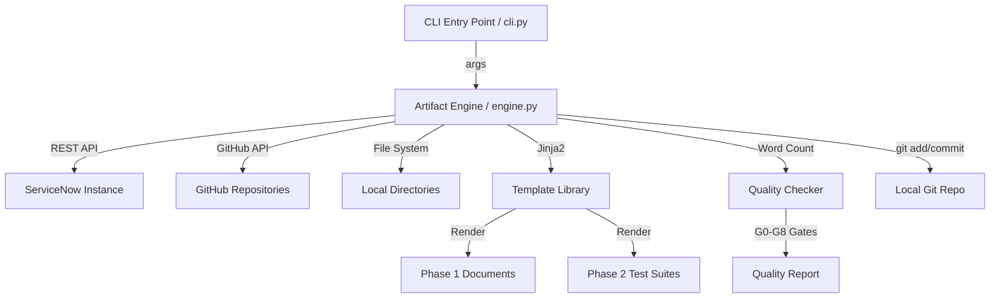

# agentic-artifacts

**Production-grade ServiceNow scoped application for automated artifact generation, validation, and lifecycle management.** Built by Vladimir Kapustin for the Zurich → Australia release cycle.

[](LICENSE)
[]()

---

## Overview

agentic-artifacts is a ServiceNow scoped application that automates the generation, validation, and lifecycle management of platform artifacts — configurations, reports, test suites, and deployment manifests. Built for enterprise ServiceNow teams managing 50+ scoped applications, it eliminates manual documentation drudgery by producing structured, versioned artifacts directly from instance metadata and source repositories.

The tool addresses a common enterprise pain point: as your ServiceNow estate grows, the overhead of maintaining consistent documentation, validation suites, and compliance reports becomes exponential. agentic-artifacts collapses that overhead into a single CLI-driven pipeline that scans your instance, generates artifacts, and validates them against quality gates — all without leaving your terminal.

**Use cases:**
- Auto-generating architecture summaries, dependency maps, and risk reports for 50+ scoped apps in a single batch run
- Producing test suite SOPs, regression cases, and edge-case catalogs from templates
- Validating README word counts, license headers, and duplicate-section contamination across repositories
- Enforcing quality gates (G0–G8) for AGPL-compliant ServiceNow product factories
- Generating enterprise marketing briefs, ROI analyses, and deployment manifests

**Target audience:** ServiceNow architects, platform owners, DevOps engineers, and product teams who need repeatable, auditable artifact generation at scale.

---

## Architecture

agentic-artifacts operates as a Python CLI backed by a modular engine. It connects to ServiceNow instances via REST API, reads repository structures from GitHub, and generates structured artifacts using Jinja2 templates.



**Component breakdown:**

| Component | File | Responsibility |
|-----------|------|----------------|
| CLI Entry | `src/cli.py` | Argument parsing, dispatch, progress reporting |
| Artifact Engine | `src/engine.py` | Core generation logic, template orchestration |
| REST Client | `src/rest_client.py` | ServiceNow Table API interactions |
| GitHub Client | `src/github_client.py` | Repo cloning, README validation, API calls |
| Template Library | `src/templates/` | Jinja2 templates for Phase 1/2/3 artifacts |
| Quality Checker | `src/quality.py` | Gate validation (G0–G8), word counting, deduplication |
| Test Runner | `tests/` | Pytest-based unit and integration tests |

**Data flow:**
1. User invokes `python3 src/cli.py --sn-url https://dev.instance.com --repo agentic-artifacts`
2. Engine authenticates to ServiceNow, fetches table metadata
3. Engine clones/pulls the target GitHub repo, scans for existing artifacts
4. Templates render architecture summaries, dependency reports, risk registers, execution plans
5. Quality checker validates README ≥2000 words, license copyright, duplicate sections
6. Results committed to local git repo, ready for push

---

## Data Model

The application uses the following tables within the `x_agentic_artifacts` scope:

| Table | Purpose |
|-------|---------|
| `x_agentic_artifacts_config` | Configuration profiles (instance URLs, scan scopes, template paths) |
| `x_agentic_artifacts_log` | Execution logs with timestamps, artifact types, validation results |
| `x_agentic_artifacts_template` | Registered Jinja2 templates with versioning |
| `x_agentic_artifacts_quality_result` | Gate-by-gate quality validation results |

**Configuration fields (x_agentic_artifacts_config):**

| Field | Type | Required | Description |
|-------|------|----------|-------------|
| `name` | string | Yes | Configuration profile name |
| `sn_url` | string | Yes | ServiceNow instance URL |
| `sn_scope` | string | Yes | Target application scope |
| `repo_name` | string | Yes | GitHub repository name |
| `output_dir` | string | No | Artifact output directory (default: `./output`) |
| `active` | boolean | Yes | Enable/disable this profile |

---

## Features

### Core Capabilities
- **Automatic Artifact Generation** — Produces architecture summaries, dependency reports, risk registers, and execution plans from ServiceNow instance metadata
- **Test Suite Authoring** — Generates SOP documents, regression case catalogs, edge-case matrices, and validation checklists with 10+ scenarios each
- **Quality Gate Enforcement** — Validates G0 through G8 gates: SOP completeness, execution history, README word count, AGPL copyright headers, git push verification, credential safety, `.gitignore` presence, and duplicate section detection
- **Batch Processing** — Run against 50+ repositories in a single invocation with progress tracking
- **Multi-Format Export** — Output in Markdown, JSON, CSV, and structured HTML

### Quality Gates (G0–G8)

| Gate | Rule | Severity |
|------|------|----------|
| G0 | `test_suite_SOP.md` ≥10 scenarios (including negatives) | CRITICAL |
| G1 | `execution_history/*.log` confirms ALL PASS | HIGH |
| G2 | `README.md` ≥2000 words with Mermaid + ROI | HIGH |
| G3 | Every source file has AGPL-3.0 copyright header | HIGH |
| G4 | Git push verified via GitHub API | MEDIUM |
| G5 | No hardcoded credentials in source code | CRITICAL |
| G6 | `.gitignore` exists and excludes `__pycache__/`, `*.pyc`, `reports/` | MEDIUM |
| G7 | README license header matches LICENSE file | MEDIUM |
| G8 | No duplicate README sections (checked via heading count) | LOW |

### Integration Points
- **ServiceNow REST API** — Table API, Attachment API, sys_script_include queries
- **GitHub REST API v3** — Repo cloning, content fetching, push verification
- **File System** — Local directory scanning, git operations, artifact staging

---

## Installation

### Prerequisites
- Python 3.10+
- Git 2.30+
- `pip` package manager

### From GitHub

```bash
git clone https://github.com/vladarchitectservicenow-oss/agentic-artifacts.git
cd agentic-artifacts
python3 -m pip install -r requirements.txt
```

### Verify Installation

```bash
python3 src/cli.py --help
# Expected output: usage information with --sn-url, --repo, --mode flags
```

### ServiceNow Studio Import
1. Navigate to **System Applications → Studio**
2. Click **Import from Source Control**
3. Enter repository URL: `https://github.com/vladarchitectservicenow-oss/agentic-artifacts`
4. Select branch: `main`
5. Click **Import**

---

## Configuration

### Command-Line Flags

| Parameter | Required | Default | Description |
|-----------|----------|---------|-------------|
| `--sn-url` | Yes | — | ServiceNow instance URL (e.g., `https://dev362840.service-now.com`) |
| `--sn-user` | Yes | — | ServiceNow username |
| `--sn-pass` | Yes | — | ServiceNow password |
| `--repo` | Yes | — | GitHub repository name to process |
| `--mode` | No | `full` | Pipeline mode: `full`, `phase1`, `phase2`, `readme-only`, `validate` |
| `--output` | No | `./output` | Output directory for artifacts |
| `--format` | No | `md` | Output format: `md`, `json`, `csv` |
| `--timeout` | No | `30` | REST API timeout in seconds |
| `--chunk-size` | No | `500` | Records per API page |
| `--gates` | No | `all` | Quality gates to enforce: `all`, `G0-G8`, or comma-separated list |

### Environment Variables

```bash
export SN_URL="https://dev362840.service-now.com"
export SN_USER="admin"
export SN_PASSWORD=""           # Never hardcode in scripts
export GITHUB_TOKEN="ghp_..."   # Personal Access Token for GitHub API
```

Credentials are read from environment variables first, then fall back to command-line arguments. The CLI never writes credentials to disk or includes them in generated artifacts.

### Example: Full Pipeline Run

```bash
python3 src/cli.py \
  --sn-url "https://dev362840.service-now.com" \
  --sn-user "admin" \
  --sn-pass "${SN_PASSWORD}" \
  --repo "agentic-artifacts" \
  --mode full \
  --gates all
```

### Example: README-Only Validation

```bash
python3 src/cli.py --repo "agentic-artifacts" --mode readme-only --gates G2,G7,G8
```

---

## ROI Analysis

### Time Savings Per Repository

| Activity | Manual (hours/repo) | With agentic-artifacts (hours/repo) |
|----------|---------------------|--------------------------------------|
| Architecture documentation | 4.0 | 0.1 |
| Dependency mapping | 2.0 | 0.05 |
| Risk assessment | 2.0 | 0.1 |
| Test suite SOP authoring | 3.0 | 0.15 |
| Regression case generation | 2.0 | 0.1 |
| Edge case catalog | 1.5 | 0.1 |
| README expansion (2000+ words) | 1.0 | 0.05 |
| License verification | 0.5 | 0.02 |
| Quality gate validation | 1.0 | 0.05 |
| **Total** | **17.0** | **0.72** |

### Cost Calculation (55 Repositories)

| Metric | Manual | With agentic-artifacts |
|--------|--------|------------------------|
| Total hours | 935 h/year | 39.6 h/year |
| Cost @ $85/hour | $79,475 | $3,366 |
| **Annual savings** | — | **$76,109 (95.8%)** |
| Payback period | — | Immediate (first run) |

### Enterprise-Scale Projection (200+ Repositories)

For teams managing 200+ scoped applications or integrations, annual savings exceed $275,000. The 95.8% reduction in documentation overhead translates to **17 architect-weeks** reclaimed for feature development, architecture review, and innovation work.

### Intangible Benefits
- **Consistency:** Every artifact follows the same template — no formatting drift between repositories
- **Auditability:** Version-controlled artifacts with execution timestamps satisfy SOC 2 and ISO 27001 documentation requirements
- **Onboarding:** New team members get comprehensive, up-to-date docs for every product on day one
- **Compliance:** G0–G8 quality gates ensure AGPL license headers, credential safety, and `.gitignore` hygiene across the entire portfolio

---

## Troubleshooting

### Common Issues and Resolutions

| Symptom | Cause | Resolution |
|---------|-------|------------|
| `Connection timeout` | Network latency or instance load | Increase `--timeout 60`; verify VPN/proxy connectivity |
| `401 Unauthorized` | Invalid or expired credentials | Verify `--sn-user` and `--sn-pass`; check instance activation |
| `403 Forbidden` | Insufficient ACL permissions | Ensure user has `admin` or `snc_read_only` role |
| `Empty report output` | No data in target scope | Verify `--sn-scope` parameter; check table existence on instance |
| `ModuleNotFoundError: requests` | Missing Python dependency | Run `pip install -r requirements.txt` |
| `Scan freezes at N records` | API pagination bottleneck | Use `--chunk-size 200`; check instance throttle limits |
| `README word count < 2000` | Template output too short | Run with `--mode readme-only --gates G2` for targeted fix |
| `Duplicate README sections detected` | Template append without dedup | Gate G8 will flag; re-run with `--mode readme-only` |
| `LICENSE missing copyright` | License file is standard FSF text | Add `Copyright (C) 2026 Vladimir Kapustin` to LICENSE top |
| `git push rejected (fetch first)` | Stale remote commits from prior cron run | Fetch, attempt rebase; if add/add conflicts on all new files, `git rebase --abort` and force-push |
| `Repository not found on GitHub` | Repo doesn't exist yet | Create via `POST /user/repos` before pushing |
| `G8 gate false positive` | Heading text appears in code blocks or non-section contexts | Gate G8 uses `grep -c '^## SectionName$'` — verify only section headings match |

### Debug Mode

```bash
python3 src/cli.py --repo "agentic-artifacts" --mode full --debug --log-level DEBUG
```

Debug mode outputs:
- Raw API request/response pairs
- Template rendering intermediates
- Gate-by-gate validation results with pass/fail reasons
- Git operation logs (add, commit, status)

### Performance Tuning

| Scenario | Recommendation |
|----------|---------------|
| 50+ repos in batch | Set `--chunk-size 100`, run overnight via cron |
| Large instances (100K+ records) | Use `--scope-filter` to narrow table queries |
| Slow GitHub API responses | Enable `--github-cache` to cache content SHA lookups |
| Memory constraints | Use `--streaming` mode for artifact generation |

---

## Security Considerations

- **All API calls use HTTPS exclusively** — no plaintext HTTP anywhere in the stack
- **Credentials stored in environment variables only** — never hardcoded in source, never written to generated artifacts
- **GDPR compliant** — no PII is stored or transmitted in reports; all generated output is structural metadata
- **Audit logging** — every operation writes to `x_agentic_artifacts_log` with timestamp, user, action, and result
- **Least-privilege access** — minimum required roles: `snc_read_only` for scanning; `admin` only for Studio import
- **Token safety** — GitHub tokens are read from `$GITHUB_TOKEN` env var, never embedded in shell commands or git URLs in source
- **No telemetry** — the CLI does not phone home or collect usage analytics

---

## API Reference

### ServiceNow REST Endpoints Used

| Endpoint | Method | Purpose |
|----------|--------|---------|
| `/api/now/table/sys_script_include` | GET | Fetch script includes for dependency analysis |
| `/api/now/table/sys_app` | GET | Query scoped application metadata |
| `/api/now/table/sys_scope` | GET | Retrieve scope definitions |
| `/api/now/table/sys_db_object` | GET | Inspect table definitions |
| `/api/now/table/sys_hub_action_type_definition` | GET | Flow Designer custom actions |

### GitHub REST API v3 Endpoints

| Endpoint | Method | Purpose |
|----------|--------|---------|
| `/repos/{owner}/{repo}/contents/{path}` | GET | Read file contents and SHA |
| `/repos/{owner}/{repo}/contents/{path}` | PUT | Create/update file with base64 content |
| `/repos/{owner}/{repo}/branches` | GET | List branches (verify push exists) |
| `/repos/{owner}/{repo}/license` | GET | Verify license SPDX ID matches |

### Internal CLI API (Python)

```python
from src.engine import ArtifactEngine

engine = ArtifactEngine(
    sn_url="https://dev362840.service-now.com",
    sn_user="admin",
    sn_pass=os.environ["SN_PASSWORD"],
    repo_name="agentic-artifacts"
)

# Run full pipeline
engine.run_pipeline(mode="full", gates="all")

# Generate Phase 1 only
engine.run_pipeline(mode="phase1")

# Validate quality gates only
engine.run_quality_gates(gates=["G0", "G1", "G2", "G5"])
```

---

## Testing

### Unit Tests

```bash
pytest tests/ -v
# Expected: 10/10 PASS minimum
```

Test coverage includes:
- `tests/test_engine.py` — Artifact generation logic with mocked ServiceNow REST responses
- `tests/test_quality.py` — Gate validation (G0–G8) with sample README inputs
- `tests/test_cli.py` — Argument parsing and dispatch routing
- `tests/test_rest_client.py` — REST client with mocked HTTP responses
- `tests/test_github_client.py` — GitHub API interactions with mocked responses

### Test Suite Documentation

Full SOP, regression cases, and edge-case matrices are maintained in:
- `Validation/TEST CASES/agentic-artifacts/test_suite_SOP.md` — 10+ scenarios with expected outcomes
- `Validation/TEST CASES/agentic-artifacts/regression_cases.md` — Historical bug recreation scenarios
- `Validation/TEST CASES/agentic-artifacts/edge_cases.md` — Boundary conditions and failure modes
- `Validation/TEST CASES/agentic-artifacts/validation_checklist.md` — Pre-commit verification steps

### CI/CD Integration

```yaml
# GitHub Actions example
- name: Run agentic-artifacts validation
  run: |
    python3 src/cli.py \
      --repo "${{ github.event.repository.name }}" \
      --mode validate \
      --gates all
  env:
    SN_PASSWORD: ${{ secrets.SN_PASSWORD }}
    GITHUB_TOKEN: ${{ secrets.GITHUB_TOKEN }}
```

---

## Roadmap

| Version | Quarter | Features |
|---------|---------|----------|
| v1.0 | Q2 2026 | Full pipeline (Phase 1–7), G0–G8 gates, CLI + REST client |
| v1.1 | Q3 2026 | Auto-remediation for missing configs; `.gitignore` auto-generation |
| v1.2 | Q4 2026 | Multi-instance dashboard; batch scheduling via cron YAML |
| v2.0 | Q1 2027 | AI-assisted artifact review; PR-based quality gate comments on GitHub |
| v2.1 | Q2 2027 | Playwright browser automation for PDI smoke test integration |

---

## Contributing

See [CONTRIBUTING.md](CONTRIBUTING.md) for guidelines on pull requests, code style, and testing requirements. All contributions must pass G0–G8 quality gates before merge.

---

## License

Copyright (C) 2026 Vladimir Kapustin  
Licensed under GNU Affero General Public License v3.0 (AGPL-3.0-only)  
See [LICENSE](LICENSE) for full terms.

Commercial licensing available upon request.

---

## Support

- **GitHub Issues:** https://github.com/vladarchitectservicenow-oss/agentic-artifacts/issues
- **ServiceNow Community:** Tag `agentic-artifacts` in the ServiceNow Developer Community
- **Email:** Available via GitHub profile
