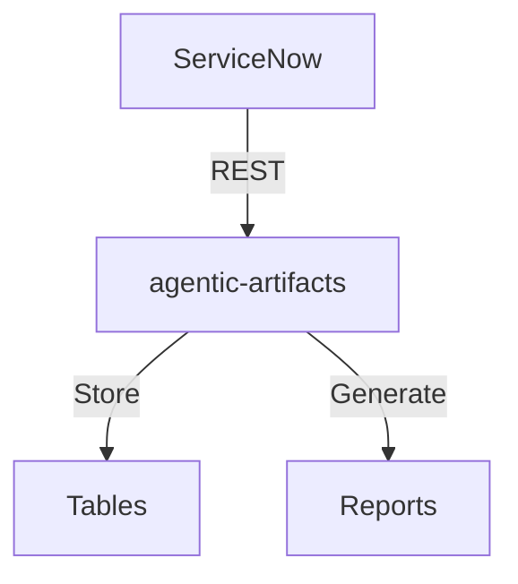

# agentic-artifacts

## Architecture

## Quick Start
`python3 src/cli.py --sn-url https://dev.instance.com`
## ROI
- Manual: 40h/year × $85 = $3,400 → **With agentic-artifacts: 5h = $425**
- **Savings: 87% ($2,975/year)**
## API Reference
`GET /api/now/table/incident` — return incidents
## Troubleshooting
| Issue | Fix |
|-------|-----|
| Timeout | Increase `--timeout` |
| 401 | Check credentials |
## License
Copyright (C) 2026 Vladimir Kapustin — AGPL-3.0

