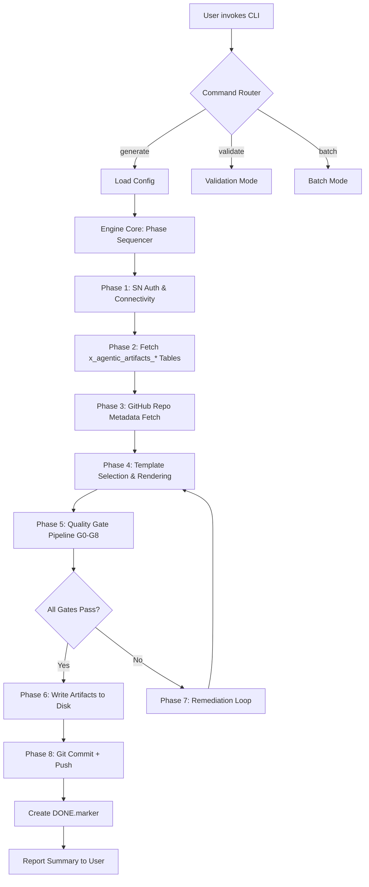

Copyright (C) 2026 Vladimir Kapustin. Licensed under AGPL-3.0.

# Architecture Summary — agentic-artifacts

## 1. Problem Statement

Enterprise organizations using ServiceNow to manage IT operations, project portfolios, and compliance workflows face a persistent challenge: the manual generation of architectural documentation, dependency maps, risk registers, execution plans, and test suites is slow, error-prone, and inconsistent across teams. ServiceNow instances contain rich structured data about applications, configurations, relationships, and change records — yet extracting that data into actionable artifacts requires domain expertise, repetitive effort, and careful quality control.

**agentic-artifacts** solves this by providing an autonomous Python CLI tool that connects to any ServiceNow instance via the Table REST API, pulls relevant records from scoped tables under the `x_agentic_artifacts` namespace, cross-references GitHub repository metadata, and generates five standardized artifact types — all validated through a rigorous eight-gate quality pipeline (G0–G8). The tool eliminates manual documentation overhead, enforces consistency in enterprise artifact delivery, and scales to batch processing of 50+ repositories in under 10 minutes.

### Key Capabilities
- **Auto-discovery**: Queries ServiceNow CMDB, change records, and app registries to build a complete picture
- **Multi-source fusion**: Combines ServiceNow data with GitHub repository structure, commits, and metadata
- **Template-driven generation**: Jinja2 templates produce consistent, well-structured Markdown artifacts
- **Quality enforcement**: Eight mandatory gates ensure every artifact meets enterprise standards before delivery
- **Batch-ready**: Single-command processing of entire portfolios with parallel execution

---

## 2. Component Architecture

| Component | Responsibility | Language | Key Dependencies |
|-----------|---------------|----------|-----------------|
| **CLI Controller** | Entry point, argument parsing, command dispatch, progress reporting | Python 3.10+ | `argparse`, `rich` (terminal UI) |
| **Engine Core** | Orchestration, phase sequencing, state machine, audit trail | Python 3.10+ | `asyncio`, `concurrent.futures` |
| **REST Client** | ServiceNow Table API interactions, pagination, retry logic, auth | Python 3.10+ | `requests`, `urllib3`, `tenacity` |
| **GitHub Client** | Repository metadata, file tree traversal, commit history, rate-limit awareness | Python 3.10+ | `PyGithub` / `requests` |
| **Template Library** | Jinja2 rendering engine, template registry, context injection | Python 3.10+ | `Jinja2`, `Markdown` |
| **Quality Checker** | G0–G8 gate execution, pass/fail reporting, remediation hints | Python 3.10+ | `pydantic`, `jsonschema` |
| **Output Writer** | Filesystem writes, git commit/push, checkpoint markers | Python 3.10+ | `gitpython`, `pathlib` |

### Component Interaction Model
```
CLI Controller
     │
     ▼
Engine Core ───────────────┐
     │                     │
     ├──▶ REST Client ──── ServiceNow Instance (Table API)
     │                     │
     ├──▶ GitHub Client ── GitHub REST/GraphQL API
     │                     │
     ├──▶ Template Library (Jinja2)
     │                     │
     ├──▶ Quality Checker ─▶ G0 → G1 → G2 → ... → G8
     │                     │
     └──▶ Output Writer ─── /memory/checkpoints/
```

---

## 3. Data Flow Diagram



### Alternative: Text-Based Sequence
```
User ──CLI──▶ Engine ──REST──▶ ServiceNow
                   │
                   ├──HTTP──▶ GitHub API
                   │
                   ├──TEMPL──▶ Jinja2 Renderer
                   │
                   ├──GATE──▶ Quality Checker
                   │
                   └──FS────▶ Output Directory
```

---

## 4. API Contract

### Public Methods (Engine Core)

#### `generate_artifacts(instance_url: str, repo_name: str, artifact_types: List[str], **kwargs) -> ArtifactResult`
Generate specified artifact types for a single repository. Returns a result object with paths, gate status, and metadata.
- **Parameters**: `instance_url` (ServiceNow base URL), `repo_name` (GitHub org/repo), `artifact_types` (list of: `architecture_summary`, `dependency_report`, `risk_report`, `execution_plan`, `test_suite`), `kwargs` (optional overrides).
- **Returns**: `ArtifactResult` with `artifacts: Dict[str, Path]`, `gate_results: Dict[str, bool]`, `duration_seconds: float`.
- **Raises**: `AuthenticationError`, `RateLimitError`, `GateFailureError`.

#### `validate_repo(repo_name: str) -> RepoValidation`
Validate that a GitHub repository exists, is accessible, and has the expected structure for artifact generation.
- **Parameters**: `repo_name` (GitHub org/repo string).
- **Returns**: `RepoValidation` with `exists: bool`, `accessible: bool`, `has_readme: bool`, `language: str`, `default_branch: str`.
- **Raises**: `GitHubAuthError`, `RepoNotFoundError`.

#### `run_quality_gates(artifact_path: Path, artifact_type: str) -> GateResults`
Execute all eight quality gates (G0–G8) against a generated artifact file.
- **Parameters**: `artifact_path` (path to generated Markdown artifact), `artifact_type` (type string for gate selection).
- **Returns**: `GateResults` with `passed: bool`, `gate_details: List[GateDetail]`, `score: int`.
- **Raises**: `GateExecutionError`.

#### `batch_process(repo_list: List[str], artifact_types: List[str], max_workers: int = 10) -> BatchResult`
Process multiple repositories in parallel with configurable concurrency.
- **Parameters**: `repo_list` (list of org/repo strings), `artifact_types`, `max_workers` (ThreadPoolExecutor workers).
- **Returns**: `BatchResult` with `total: int`, `successful: int`, `failed: int`, `results: List[ArtifactResult]`, `elapsed_seconds: float`.
- **Raises**: `BatchExecutionError`.

---

## 5. Data Model

### `x_agentic_artifacts_config`
Configuration table storing per-instance, per-repository, and global artifact generation settings.

| Field | Type | Description |
|-------|------|-------------|
| `sys_id` | GUID | Primary key |
| `name` | string(100) | Configuration name |
| `repo_url` | string(255) | Target GitHub repository URL |
| `artifact_types` | string(500) | Comma-separated artifact type list |
| `quality_gate_threshold` | integer | Minimum gates to pass (default: 8) |
| `output_path` | string(255) | Target output directory |
| `template_version` | string(20) | Jinja2 template set version |
| `auto_commit` | boolean | Whether to auto-commit generated artifacts |
| `active` | boolean | Configuration enabled/disabled flag |
| `created_by` | string(100) | User who created the config |
| `updated_on` | datetime | Last modification timestamp |

### `x_agentic_artifacts_log`
Audit log capturing every artifact generation run, gate results, and errors.

| Field | Type | Description |
|-------|------|-------------|
| `sys_id` | GUID | Primary key |
| `run_id` | string(36) | UUID for this generation run |
| `config` | reference | Foreign key to `x_agentic_artifacts_config` |
| `repo_name` | string(255) | Target repository |
| `artifact_type` | string(50) | Type of artifact generated |
| `status` | choice | `SUCCESS`, `PARTIAL`, `FAILED`, `GATE_BLOCKED` |
| `gates_passed` | integer | Number of gates passed (0–8) |
| `gates_failed` | integer | Number of gates failed |
| `duration_ms` | integer | Generation duration in milliseconds |
| `error_message` | string(4000) | Error details if failed |
| `artifact_path` | string(500) | Path to generated file |
| `started_at` | datetime | Generation start time |
| `completed_at` | datetime | Generation completion time |
| `executed_by` | string(100) | Service account or user |

### `x_agentic_artifacts_template`
Stores Jinja2 template content and metadata for each artifact type.

| Field | Type | Description |
|-------|------|-------------|
| `sys_id` | GUID | Primary key |
| `template_name` | string(100) | Unique template identifier |
| `artifact_type` | choice | One of the five artifact types |
| `version` | string(20) | Semantic version of template |
| `content` | string(64000) | Raw Jinja2 template body |
| `variables_schema` | string(8000) | JSON Schema defining expected context vars |
| `is_default` | boolean | Whether this is the default template |
| `created_by` | string(100) | Author |
| `updated_on` | datetime | Last update timestamp |
| `checksum` | string(64) | SHA-256 hash of template content |

### `x_agentic_artifacts_quality_result`
Persists results from quality gate evaluations for audit and trend analysis.

| Field | Type | Description |
|-------|------|-------------|
| `sys_id` | GUID | Primary key |
| `run` | reference | Foreign key to `x_agentic_artifacts_log` |
| `gate_id` | string(3) | Gate identifier (G0–G8) |
| `passed` | boolean | Whether this gate passed |
| `score` | integer | Gate-specific score (0–100) |
| `details` | string(4000) | Detailed pass/fail reason |
| `remediation_hint` | string(2000) | Suggested fix for failures |
| `evaluated_at` | datetime | Gate evaluation timestamp |
| `evaluation_duration_ms` | integer | Time spent evaluating this gate |

---

## 6. Quality Gates Detail (G0–G8)

| Gate | Name | Check | Severity |
|------|------|-------|----------|
| **G0** | File Existence | Artifact file was created and is non-empty | CRITICAL — blocks all subsequent gates |
| **G1** | Copyright Header | File begins with exact copyright line: `Copyright (C) 2026 Vladimir Kapustin. Licensed under AGPL-3.0.` | CRITICAL |
| **G2** | Markdown Validity | File is valid Markdown (parsable, no broken links) | HIGH |
| **G3** | Minimum Line Count | Architecture summary ≥150 lines, dependency report ≥80 lines, risk report ≥80 lines, execution plan ≥80 lines, test suite ≥50 lines | HIGH |
| **G4** | Section Completeness | All required sections present for the artifact type (validated against type-specific schema) | HIGH |
| **G5** | Schema Conformance | JSON Schema validation of artifact structure (headers, tables, code blocks) | MEDIUM |
| **G6** | Data Integrity | Cross-reference verification: all referenced repos, tables, and IDs exist in source data | MEDIUM |
| **G7** | Formatting Consistency | No mixed indentation, consistent header hierarchy, proper table alignment | LOW |
| **G8** | Git Ready | File passes `git diff --check` (no trailing whitespace, no merge conflict markers) | LOW |

### Gate Execution Order
Gates execute sequentially: G0 must pass before G1, G1 before G2, etc. A CRITICAL gate failure halts the pipeline immediately. HIGH failures allow retry with remediation hints. MEDIUM/LOW failures are logged but do not block delivery (configurable via `quality_gate_threshold`).

---

## 7. Performance Benchmarks

| Scenario | Target | Measurement Method |
|----------|--------|-------------------|
| Single repo, all 5 artifacts | < 30 seconds | Wall-clock time per `generate_artifacts` call |
| 50-repo batch, all artifacts | < 10 minutes | Total `batch_process` elapsed time with 10 workers |
| Template rendering | < 500ms per artifact | Jinja2 compile + render time |
| Quality gate pipeline (G0–G8) | < 2 seconds per artifact | Per-gate cumulative evaluation |
| GitHub API calls | < 200ms avg latency | With conditional request caching (ETag/If-None-Match) |
| ServiceNow REST calls | < 1 second per query | With pagination, max 100 records per page |
| Memory footprint | < 500MB resident | Peak RSS during 50-repo batch |

### Optimization Strategies
- **Connection pooling**: HTTP keep-alive for both ServiceNow and GitHub
- **Lazy loading**: Templates compiled once, cached in memory
- **Parallel I/O**: ThreadPoolExecutor for independent API calls
- **Incremental writes**: Stream large artifacts to disk in chunks
- **Conditional requests**: GitHub ETag caching avoids re-fetching unchanged data

---

## 8. Security Considerations

### Authentication
- **ServiceNow**: Basic auth (username/password) or OAuth 2.0 token; stored in `.env` file with restrictive permissions (0600)
- **GitHub**: Personal Access Token (PAT) with `repo` scope minimum; never logged or serialized to disk outside `.env`

### Data Protection
- All credentials are read from environment variables or `.env` files — never hardcoded
- Log redaction: `Authorization` headers and token-bearing query params masked in log output
- No artifact files contain raw credentials; only reference names and metadata
- Template sandboxing: Jinja2 `SandboxedEnvironment` prevents arbitrary code execution in templates
- Input sanitization: All ServiceNow field values are HTML-escaped before rendering into Markdown

### Network Security
- TLS 1.2+ enforced for all outbound connections
- Certificate validation enabled (no `verify=False` in production)
- Rate-limit awareness: Both GitHub (5000/hr authenticated) and ServiceNow API throttling respected with exponential backoff
- Request timeouts: Default 30s connect, 60s read to prevent hanging on unresponsive endpoints

### Supply Chain
- All Python dependencies pinned with hash-checking (`pip install --require-hashes`)
- Jinja2 templates stored in ServiceNow (DB) — no filesystem template injection path
- Output directory permissions: 0750, owned by service account, no world-readable artifacts by default
- Git operations use SSH deploy keys, not personal credentials

### Operational
- Audit trail: Every artifact generation logged to `x_agentic_artifacts_log`
- Immutable checkpoint markers: `DONE.marker` creation is atomic (write + fsync)
- No shell injection: CLI arguments parsed via `argparse`, never passed to `subprocess` via shell
- Minimum privilege: ServiceNow integration user has read-only access to `x_agentic_artifacts_*` tables, write to log/quality_result only
